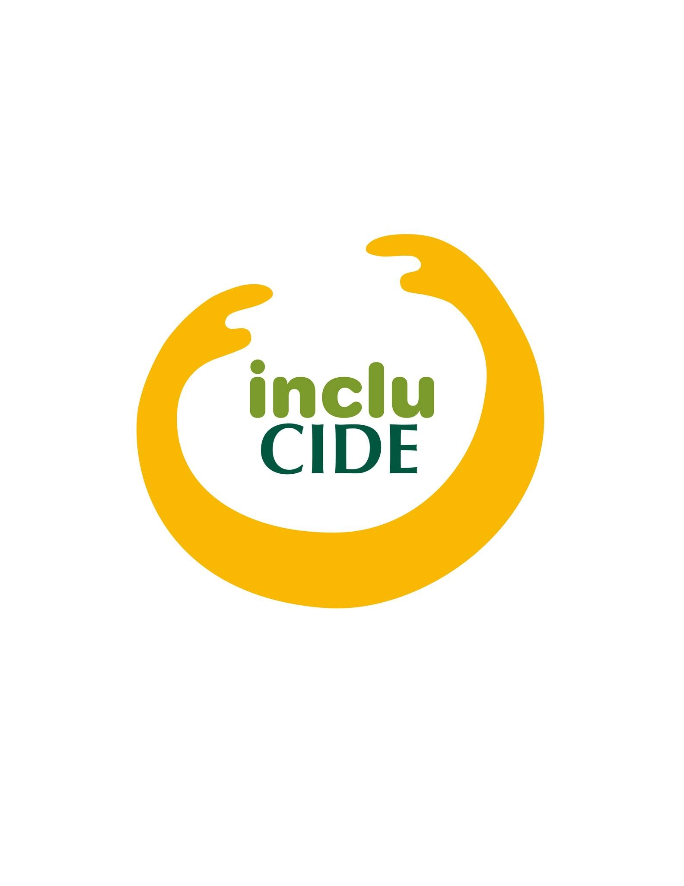

<picture>
  
</picture>

# Planeación del curso de francés del CIDE. (Español): Para los tutores.

**Autor del documento:** Donovan Byron Díaz Moreno. Licenciatura en Economía (CIDE) - Generación 2022.

**Revisado y comentado**: Itzel Angélica Costa Corona. Licenciatura en pedagogía (UTM) - Generación 2018

**Revisado y comentado**: Ameyalli López López. Licenciatura en Economía (CIDE) - Generación 2022.

### ¿Qué encontrarán en este documento?

- La metodología de los cursos de francés.
- Cronograma del curso.
- Temario de cada sección del curso (A1, primera y segunda parte, A2 y B1).
- Recursos por nivel para los estudiantes: recomendaciones.
- Notas finales.

### Metodología:

Para que todos los estudiantes puedan alcanzar el objetivo de hablar francés con fluidez una vez que hayan terminado el curso, vamos a seguir la siguiente metodología:

1. **Cada clase integra contenido léxico Y gramatical.**
    1. En cada sesión (martes y jueves), los estudiantes aprenderán vocabulario nuevo junto con las estructuras gramaticales necesarias para usarlo.
    2. **Principio fundamental**: No se enseña gramática sin vocabulario para practicarla, ni vocabulario sin gramática para estructurarlo.
2. **Progresión en espiral:**
    1. Los temas se introducen, practican, y retoman en semanas posteriores con mayor profundidad.
    2. Cada semana construye sobre lo aprendido anteriormente, reforzando conexiones.

---

### 🎯 ADAPTACIONES PARA ADOLESCENTES (12-15 AÑOS) - Actualización 2026

**Contexto:** Estudiantes mexicanos en modalidad online.

#### Características de nuestra audiencia:
- **Atención sostenida**: 15-20 minutos máximo por actividad
- **Nativos digitales**: Familiaridad con tecnología, preferencia por contenido visual
- **Influencia de pares**: Aprenden mejor en colaboración
- **Sensibilidad a la crítica**: Requieren ambiente seguro para cometer errores
- **Necesidad de relevancia**: Conectar contenido con sus intereses (música, series, deportes, redes)

#### Ajustes metodológicos:
1. **Regla 10-10-10**: Cambiar actividad cada 10 min, mínimo 10 interacciones, no hablar más de 10 min seguidos
2. **Gamificación**: Puntos, insignias, competencias por equipos
3. **Contenido relevante**: Ejemplos con influencers, series, música que conocen
4. **Trabajo colaborativo**: Breakout rooms, proyectos en equipo
5. **Retroalimentación positiva**: Corregir sin humillar, celebrar el esfuerzo

#### Adaptaciones para modalidad online México:
- **Sesiones de 50 minutos** (no 2 horas) para evitar fatiga de pantalla
- **Materiales descargables** para quienes tienen conectividad intermitente
- **WhatsApp como backup** para comunicación cuando falla internet
- **Videos de apoyo cortos** (3-5 min) para repaso asíncrono

---

**Nota: Actualización 2026.** 

- Después de nuestra experiencia con los cursos de francés de IncluCIDE, implementamos una integración completa de léxico y gramática en TODAS las sesiones de TODOS los niveles.
    - **Resultado esperado**: Los estudiantes pueden usar inmediatamente lo que aprenden, sin esperar a "la clase de gramática".

---

### El trabajo durante la semana: Profesores y alumnos

**👨‍🎓 Alumnos:**
- **Práctica diaria**: Dedicar 15-20 minutos diarios (lunes a viernes) a repasar con:
    - **Duolingo**: 10 minutos de práctica gamificada
    - **Videos de pronunciación**: 5 minutos con Piece of French o Inner French
    - **Flashcards**: Quizlet con vocabulario de la semana
- **Tareas semanales**: 2 asignaciones en Classroom (martes y jueves)
- **Herramientas de IA permitidas para práctica**:
    - ChatGPT: Conversación práctica (con prompts estructurados)
    - Elsa Speak/Speechify: Práctica de pronunciación
    
**👨‍🏫 Profesores:**
- **Guías de clase**: Cada sesión tiene una guía detallada minuto a minuto
- **Materiales pre-generados**: Presentaciones, actividades, Kahoots listos
- **Corrección eficiente**: Uso de IA para retroalimentación de tareas escritas
- **Seguimiento de datos**: Formulario post-clase para análisis de progreso

---

### Evaluaciones parciales: encaminándonos hacia el examen de certificación DELF Junior B1
    1. **Video de evaluación oral cada parcial.**
        1. **Cada tres semanas** habrá evaluaciones en las que los estudiantes grabarán un video **en francés** que será evaluado por los profesores para mostrar los errores que han cometido.
            1. En total, habrá 3 evaluaciones de este tipo durante el semestre.
        2. **¿En qué consiste la evaluación de producción oral?** 
            1. Tendrán la tarea de hablar de un tópico haciendo uso de los aprendizajes adquiridos durante las semanas de clase. 
        3. **Duración de los vídeos:**
            1. Primer semestre: De 30 segundos a 1 minuto
            2. Segundo semestre: de 1 minuto a 1 minuto y treinta segundos
            3. Tercer semestre: 2 minutos a 2 minutos y treinta segundos
            4. Cuarto semestre: 3 minutos o más
            5. Quinto semestre 3 minutos treinta segundos o más
    2. **Evaluaciones de comprensión oral**
        1. **Frecuencia**: Cada tres semanas.
            1. En total, habrá 3 evaluaciones de este tipo durante el semestre.
        2. **¿En qué consiste la evaluación de comprensión oral?** 
            1. El video debe ser reproducido especialmente los días de aprendizaje léxico (cada semana impar).
            - Con cada video, los estudiantes deben responder a algunas preguntas con el fin de verificar la comprensión del video.
                - **Duración estimada: 30 minutos**
    3. **Evaluación de comprensión de textos escritos**
        1. **Frecuencia**: Cada tres semanas
        2. **¿En qué consiste la evaluación de comprensión oral?** 
            1. Durante los cursos, los profesores deben asignar algunos textos con la intención de acostumbrar a los estudiantes a leer textos en francés.
                - https://www.podcastfrancaisfacile.com/apprendre-le-francais/liste-des-textes-fle
                    - En el sitio de internet de arriba, los profesores pueden encontrar muchos textos de diferentes niveles. Estos textos contienen la transcripción de cada texto, de manera que si el profesor lo considera importante, también puede reproducir la grabación una vez que la lectura haya terminado.
                        - **Duración estimada: 30 minutos**
    4. **Evaluación de producción escrita.** 
        1. **Frecuencia**: Cada tres semanas. 
            - Los estudiantes deben producir textos (30 minutos para escribirlos), con el fin de evaluar sus conocimientos en los temas de los que hemos hablado durante los cursos.
            - Cada profesor debe asegurarse de que el texto que los estudiantes van a escribir esté relacionado con los temas de una de las unidades revisadas.
            - Número de palabras
                1. Primer semestre: De 30 a 50 palabras
                2. Segundo semestre: De 50 a 70 palabras
                3. Tercer semestre: De 70 a 100 palabras
                4. Cuarto semestre: De 160 a 200 palabras
                    1. El requisito para los ensayos del examen DELF B1 es de 160 palabras como mínimo
                    2. Tienen 45 minutos para escribirlo
                5. Quinto semestre: De 200 a 250 palabras
                    1. El requisito para los ensayos del examen DELF B1 es de 250 palabras como mínimo
                    2. Tienen 1h00 para escribirlo
3. **Gestión de grupos:**
    1. Cada grupo de francés estará compuesto por dos profesores, los cuales impartirán dos horas el martes y Jueves. 

**Estructura del examen DELF B1 Junior.** 

**Producción escrita - writing - escritura.** 

- **B1** **junior**→ en su ciudad hay un problema de contaminación del agua, ustedes le escriben una “lettre ouvert” (carta) al alcalde de la ciudad para exponerle.
    - la situación actual.
    - pros y contras de arreglar.
    - consejo qué hacer con ese problema.
    - **elementos:**
        - **formalidad.**
        - ortografía y gramática correcta

**Producción oral - speaking - hablar.** 

- **B1 junior: 3 partes**
    - **presentar**: hobbies, qué quieren hacer el futuro, qué hacen ahora, aspectos de su personalidad.
    - **ejercicio de interacción**: imagínense una situación
        - metro de París y perdieron su ticket del metro entonces quieren arreglar esa situación con el oficial de policia para que paguen una multa.
        - llegaron a la escuela 10 minutos tarde y tenían que presentar un examen y convencen al profesor para que los dejen prenstar esa prueba.
    - **exposición**:
        - tele escuela.

 **Comprensión escrita - reading - lectura** 

- textos de los cuáles tienen que resonder preguntas.

 **Comprensión oral - listening - escucha.** 

- emisión de radio.
- programa de noticias.
- una conversación.
- debate.

***** acentos. B2 - Québec, Canadá. africanos, congo, camerún, mali. europa: el suizo, belga.** 

### Metodología opcional para algunos estudiantes, en el caso que ellos lo requieran:

1. Vídeo semanal del resumen de cada tema:
    1. Con un vídeo por semana (5 minutos como mínimo), los estudiantes grabarán un vídeo mostrando :
        1. lo que han aprendido durante la semana.
        2. lo que más les ha gustado en relación con los temas.

## **Nivel A1.1: Primer semestre**

El nivel A1 será posible a través de un semestre completo, con un ritmo más o menos acelerado, los objetivos finales serán los siguientes:

**Objetivos generales:** 

- Presentación (Primera y segunda semana)
- Presentación de otra persona (Tercera y cuarta semana)
- Hablar de un miembro de la familia (Quinta y sexta semana)
- Hablar de su día (Séptima y octava semana).
- Describir su entorno (Novena y décima semana).
- Describir su casa (Undécima semana).

**Objetivos gramaticales:**

Al final de esta unidad, los estudiantes aprenderán los siguientes tiempos verbales:

- El presente del indicativo
    - Conjugación de los verbos de 3er grupo, 2do grupo y 3er grupo.
    - La interrogación
    - La negación
- Pasado reciente
- Futuro cercano
- Presente progresivo

### Cronograma:

Crear un plan de estudios para aprender francés desde cero para el nivel A1 según el examen DELF para todo público requiere una cuidadosa estructuración del tiempo y los contenidos. Considerando que disponemos de 11 martes, con 2 horas cada martes, tenemos un total de 22 horas de estudio. Aquí está la distribución semanal:

¿Cuándo aprender a pronunciar en francés?

- Lista de vocales nasales:
    - Archivo ya creado en Google Drive

Aquí tienes el temario con títulos más adecuados para cada semana:

### Semana 1: **Introducción al idioma y el aula.**

**Martes.** 

https://drive.google.com/drive/u/0/folders/1dsMsRXYa6oiQsG8g3_JxnB5fFbW_0TYF

- **Contenido léxico y gramatical:**
    - Introducción al curso (30-40 min, sin grabar).
    - **Alfabeto francés** - pronunciación y escritura
    - **Gramática integrada**: Estructura "Je suis + nombre" para presentarse
    - **Práctica**: Deletrear nombres propios, presentarse: "Je suis María, M-A-R-Í-A"

**Jueves.** 

https://drive.google.com/drive/u/0/folders/1YZPFHXggxOpfZVJyJRVHvSxrd3kB6yI5

- **Contenido léxico y gramatical:**
    - **Fórmulas de saludos** (Bonjour, Bonsoir, Salut, Au revoir, À bientôt)
    - **Números (0-20)** - pronunciación y escritura
    - **Gramática integrada**: Artículos definidos básicos (le, la) 
    - **Objetos del aula** con artículos: le livre, la gomme, le stylo
    - **Práctica**: Saludarse + contar + nombrar objetos

**Tareas:** 

1. que los alumnos graben un audio diciendo el alfabeto y que lo escriban en francés. 
    1. para esto hay que crear un grupo de tareas de Whatsapp. 
2. que los alumnos graben y escriban un audio diciendo los números del 1-20 y que los escriban
3. que los alumnos graben un audio y escriban los saludos en francés.  

**Vídeos de apoyo:** 

https://www.youtube.com/watch?v=cN76TfurexQ

https://www.youtube.com/watch?v=bz-XzF3_8nM

https://www.youtube.com/watch?v=Xw4H18Fxx7E&t=42s

### Semana 2: **Fundamentos: Verbos SER y TENER**

**Martes**

- **Contenido léxico y gramatical:**
    - **Expresiones del aula** (Répétez, Je ne comprends pas, Comment dit-on...?)
    - **Objetos del aula** (le cahier, le crayon, la table, la chaise, l'ordinateur)
    - **Gramática**: Artículos definidos (le, la, l', les) e indefinidos (un, une, des)
    - **Práctica integrada**: C'est un livre, C'est une table, Ce sont des crayons

**Jueves**

- **Contenido léxico y gramatical:**
    - **Pronombres sujetos** (je, tu, il/elle/on, nous, vous, ils/elles)
    - **Verbo ÊTRE** - conjugación completa + **Verbo AVOIR** - conjugación completa
    - **Vocabulario de estados**: content, fatigué, triste, malade
    - **Práctica integrada**: Je suis content, J'ai un livre, Tu es fatigué, Il a des crayons

### Semana 3: **Presentación personal completa**

**Martes**

- **Contenido léxico y gramatical:**
    - **Vocabulario de presentación**: nom, prénom, âge, origine
    - **Países principales** (la France, le Mexique, l'Espagne, les États-Unis, le Canada)
    - **Nacionalidades** (français/française, mexicain/mexicaine, espagnol/espagnole)
    - **Gramática**: Formación masculino/femenino de nacionalidades
    - **Práctica**: Je m'appelle..., J'ai... ans, Je suis mexicain/mexicaine, Je viens de...

**Jueves** 

- **Contenido léxico y gramatical:**
    - **Profesiones** (étudiant/e, professeur, médecin, ingénieur, avocat/e, secrétaire)
    - **Verbos -ER regulares**: parler, étudier, habiter, travailler
    - **Gramática**: Conjugación verbos 1er grupo en presente
    - **Práctica integrada**: J'étudie le français, Je parle espagnol, J'habite à Mexico

### Semana 4: **La interrogación y la fecha**

**Martes**

- **Contenido léxico y gramatical:**
    - **Palabras interrogativas** (Comment? Qui? Où? Quand? Pourquoi? Quel/Quelle?)
    - **La interrogación** - 3 formas (formal: inversion, común: est-ce que, familiar: entonación)
    - **Vocabulario**: Adjetivos de nacionalidad ampliados
    - **Práctica integrada**: Comment t'appelles-tu? Où habites-tu? Quelle est ta nationalité?

**Jueves**

- **Contenido léxico y gramatical:**
    - **Números (21-69)** - sistema francés
    - **Días de la semana** (lundi, mardi...) y **Meses del año** (janvier, février...)
    - **La fecha**: Quel jour sommes-nous? Nous sommes le + número + mes
    - **Práctica**: Quelle est ta date de naissance? Je suis né(e) le...

### Semana 5: **Familia y descripción física**

**Martes.**

- **Contenido léxico y gramatical:**
    - **Vocabulario de familia** (père, mère, frère, sœur, grand-père, grand-mère, oncle, tante, cousin/e)
    - **Adjetivos posesivos** (mon/ma/mes, ton/ta/tes, son/sa/ses, notre/nos, votre/vos, leur/leurs)
    - **Gramática**: Concordancia posesivos con sustantivo
    - **Práctica**: Voici ma famille. Mon père s'appelle..., Ma mère a... ans

**Jueves.**

- **Contenido léxico y gramatical:**
    - **Descripción física** (grand/petit, mince/gros, cheveux longs/courts, yeux bleus/marron)
    - **Colores** (blanc, noir, bleu, rouge, vert, jaune, marron, gris, roux)
    - **Gramática**: Uso de AVOIR para descripciones (Il a les cheveux..., Elle a les yeux...)
    - **Práctica integrada**: Mon frère est grand, il a les cheveux noirs et les yeux marron

### Semana 6: **Carácter, gustos y calificativos**

**Martes.**

- **Contenido léxico y gramatical:**
    - **Adjetivos de carácter** (sympathique, gentil, intelligent, travailleur, paresseux, timide)
    - **Adjetivos calificativos** - formación regular (masculino/femenino, singular/plural)
    - **Irregulares comunes** (beau/belle, vieux/vieille, nouveau/nouvelle)
    - **Práctica**: Ma sœur est sympathique et intelligente

**Jueves.** 

- **Contenido léxico y gramatical:**
    - **Verbos de gusto**: aimer, adorer, détester, préférer
    - **Pasatiempos** (le sport, la musique, la lecture, le cinéma, les jeux vidéo)
    - **Gramática**: Verbo + infinitivo (J'aime jouer, J'adore lire)
    - **Verbo FAIRE** para actividades: faire du sport, faire de la musique
    - **Práctica**: J'aime jouer au football, Je déteste faire le ménage

### Semana 7: **La hora y rutinas diarias**

**Martes.**

- **Contenido léxico y gramatical:**
    - **Números (70-100)** - consolidación del sistema francés
    - **La hora**: Quelle heure est-il? Il est... heures / ...heures et demie / ...heures et quart
    - **Expresiones de tiempo**: le matin, l'après-midi, le soir, la nuit
    - **Práctica**: À quelle heure tu te lèves? - Je me lève à 7 heures du matin

**Jueves.**

- **Contenido léxico y gramatical:**
    - **Verbos pronominales de rutina**: se réveiller, se lever, se doucher, s'habiller, se coucher
    - **Gramática**: Conjugación verbos pronominales en presente
    - **Tareas domésticas**: faire la vaisselle, faire le ménage, ranger la chambre
    - **Práctica integrada**: Le matin, je me réveille à 6h30, je me douche et je prends le petit-déjeuner

### Semana 8: **Frecuencia y verbos del segundo grupo**

**Martes**

- **Contenido léxico y gramatical:**
    - **Actividades escolares y académicas**: finir les devoirs, choisir un cours, réussir un examen, réfléchir
    - **Adverbios de frecuencia**: toujours, souvent, parfois, rarement, jamais
    - **Práctica con frecuencia**: Je finis toujours mes devoirs, Il choisit souvent le cours de maths

**Jueves**

- **Contenido léxico y gramatical:**
    - **Verbos del 2do grupo (-IR)**: conjugación completa
        - finir (je finis, tu finis, il/elle finit, nous finissons, vous finissez, ils/elles finissent)
        - choisir, réussir, grandir, réfléchir, obéir, rougir
    - **Característica**: radicaux + -iss- en plural
    - **La negación básica**: NE...PAS, NE...JAMAIS
    - **Práctica integrada**: Je ne finis jamais tard, Nous choisissons nos cours, Ils réussissent l'examen

### Semana 9: **La ciudad y verbos del tercer grupo**

**Martes**

- **Contenido léxico y gramatical:**
    - **Lugares de la ciudad** (l'école, l'hôpital, la banque, le supermarché, le parc, le restaurant, la bibliothèque)
    - **Verbos 3er grupo de movimiento**: aller, venir, partir, sortir
    - **Verbo ALLER** - conjugación completa + preposición À
    - **Artículos contractos**: au (à + le), à la, à l', aux (à + les)
    - **Práctica**: Je vais à l'école, Tu viens au parc, Nous partons au supermarché

**Jueves**

- **Contenido léxico y gramatical:**
    - **Verbos 3er grupo comunes**: prendre, faire, pouvoir, vouloir, devoir
    - **Preposiciones de localización**: à côté de, en face de, derrière, devant, entre
    - **Artículos contractos con DE**: du, de la, de l', des
    - **Práctica integrada**: Je prends le bus, Tu fais du sport, La banque est à côté du parc

### Semana 10: **Orientación en la ciudad y tiempos compuestos**

**Martes**

- **Contenido léxico y gramatical:**
    - **Indicar el camino**: Tournez à gauche/droite, Allez tout droit, Continuez jusqu'à
    - **Expresiones de distancia**: près de, loin de, à 5 minutes, à côté
    - **Futur proche** (futuro próximo): ALLER + infinitivo
    - **Práctica**: Où est la banque? - Allez tout droit, puis tournez à gauche. Je vais aller à la poste

**Jueves**

- **Contenido léxico y gramatical:**
    - **Passé récent** (pasado reciente): VENIR DE + infinitivo
    - **Présent progressif** (presente progresivo): ÊTRE EN TRAIN DE + infinitivo
    - **Actividades de fin de semana**: faire du shopping, visiter, se promener
    - **Práctica integrada con 3 tiempos**: Je viens de finir, Je suis en train d'étudier, Je vais sortir

### Semana 11: **La casa y el hogar**

**Martes:** 

- **Contenido léxico y gramatical:**
    - **Tipos de vivienda**: appartement, maison, studio, immeuble
    - **Habitaciones**: la cuisine, la chambre, le salon, la salle de bain, les toilettes
    - **Adjetivos demostrativos**: ce, cet, cette, ces
    - **IL Y A** (hay): Dans cette maison, il y a trois chambres
    - **Práctica**: J'habite dans un appartement. Il y a deux chambres et une grande cuisine

**Jueves:** 

- **Contenido léxico y gramatical:**
    - **Muebles y objetos**: le lit, la table, la chaise, l'armoire, le canapé, la télévision
    - **Puntos cardinales**: le nord, le sud, l'est, l'ouest
    - **Expresión de cantidad**: beaucoup de, un peu de, assez de, trop de
    - **Práctica**: Dans ma chambre, il y a un lit et beaucoup de livres. La fenêtre est au sud

### Semana 12: **Geografía, clima y consolidación**

**Martes:** 

- **Contenido léxico y gramatical:**
    - **Países, ciudades, regiones** (revisión ampliada)
    - **Preposiciones geográficas**: en France, au Mexique, aux États-Unis, à Paris
    - **El clima**: Il fait beau, Il fait chaud/froid, Il pleut, Il neige, Il y a du vent
    - **Práctica**: Au Mexique, il fait chaud. En France, il pleut souvent

**Jueves:** 

- **Contenido léxico y gramatical:**
    - **Consolidación de verbos 3er grupo**: faire, pouvoir, vouloir, devoir, savoir, connaître
    - **Números (100-1000)** y precios
    - **Frutas y verduras**: la pomme, l'orange, la banane, la tomate, la carotte
    - **Repaso integrado**: Presentación oral completa usando todo el vocabulario del semestre
    - **Práctica final**: Parler de soi, sa famille, ses activités, sa maison, sa ville

Este plan de estudio tiene como objetivo proporcionar una base sólida en francés para el nivel A1. Se recomienda complementar las clases con estudio individual, que puede incluir escuchar música en francés, ver videos educativos y practicar con aplicaciones de aprendizaje de idiomas. Además, es vital que el estudiante revise y practique lo que ha aprendido durante la semana antes de la próxima clase. 

## **Nivel A1 (Segunda parte): Segundo semestre.**

**Objetivos generales:**

- Ir de compras y describir los estilos de ropa (Primera y segunda semana)
- Hablar sobre los tipos de comidas y sus ingredientes (Tercera y cuarta semana)
- Etapas de la vida (Quinta y sexta semana)
- Narrar eventos puntuales del pasado y los aprendizajes de la vida (Séptima y octava semana)

**Objetivos gramaticales:**

Al final de esta unidad, los estudiantes aprenderán los siguientes tiempos verbales:

- Pasado compuesto
    - Participio pasado
    - Interrogación
    - Negación
    - Concordancia
- Uso de pronombres
    - Pronombre "en"
    - Pronombre COD
    - Pronombre COI

### Cronograma:

### Semana 1: **Ir de compras: la ropa**

**Martes:**

- **Contenido léxico y gramatical:**
    - **Ropa** (le pantalon, la chemise, la robe, la jupe, les chaussures, la veste, le pull, le t-shirt)
    - **Verbos de compra**: acheter, essayer, payer, porter, mettre
    - **Gramática**: Verbo METTRE - conjugación
    - **Práctica**: Je porte un pantalon noir, Je veux essayer cette robe

**Jueves:**

- **Contenido léxico y gramatical:**
    - **Colores** (revisión ampliada con matices: bleu clair, vert foncé)
    - **Materiales y patrones**: coton, laine, cuir, soie / rayé, à pois, fleuri
    - **Expresiones de compra**: Combien ça coûte? C'est cher/pas cher, C'est en solde
    - **Práctica integrada**: Je cherche une chemise en coton bleu, Combien coûte cette veste?

### Semana 2: **Tallas, adjetivos y verbos modales**

**Martes:**

- **Contenido léxico y gramatical:**
    - **Tallas y medidas**: petit, moyen, grand / la taille, la pointure
    - **Adjetivos demostrativos** (repaso): ce, cet, cette, ces
    - **Comparación básica**: plus grand, plus petit, trop grand, assez petit
    - **Práctica**: Cette robe est trop grande, Je cherche une taille plus petite

**Jueves:**

- **Contenido léxico y gramatical:**
    - **Adjetivos interrogativos**: quel, quelle, quels, quelles
    - **Verbos modales**: vouloir, pouvoir, devoir (conjugación completa)
    - **Expresiones de compra**: Je voudrais, Je peux essayer?, Il me faut
    - **Práctica integrada**: Quelle taille faites-vous? Je voudrais essayer cette chemise

### Semana 3: **La comida: alimentos y bebidas**

**Martes:**

- **Contenido léxico y gramatical:**
    - **Alimentos principales**: le pain, la viande, le poisson, le riz, les pâtes, le fromage, les œufs
    - **Bebidas**: l'eau, le jus, le café, le thé, le lait, le vin
    - **Gramática**: Artículos partitivos (du, de la, de l', des)
    - **Práctica**: Je mange du pain, Je bois de l'eau, Je prends du café

**Jueves:**

- **Contenido léxico y gramatical:**
    - **Comidas del día**: le petit-déjeuner, le déjeuner, le dîner, le goûter
    - **Cuantificadores**: un peu de, beaucoup de, assez de, trop de, un kilo de
    - **Verbos de comida**: manger, boire, prendre, cuisiner, préparer
    - **Práctica**: Pour le petit-déjeuner, je prends un peu de pain et beaucoup de café

### Semana 4: **En el restaurante: pedir y pronombre EN**

**Martes:**

- **Contenido léxico y gramatical:**
    - **Expresiones de restaurante**: Je voudrais..., Pour moi..., L'addition s'il vous plaît
    - **El menú**: l'entrée, le plat principal, le dessert, la boisson
    - **Describir sabores**: sucré, salé, épicé, amer, délicieux
    - **Práctica**: Qu'est-ce que vous recommandez? C'est épicé? Je voudrais le plat du jour

**Jueves:**

- **Contenido léxico y gramatical:**
    - **Pronombre EN** (reemplazo de cantidades y de + sustantivo)
    - **Pronombre COD** (le, la, l', les) - introducción con objetos de comida
    - **Gramática**: Posición de pronombres en presente
    - **Práctica**: Tu manges du pain? Oui, j'en mange / Tu aimes la soupe? Oui, je l'aime

### Semana 5: **Etapas de la vida e introducción al pasado**

**Martes:**

- **Contenido léxico y gramatical:**
    - **Etapas de la vida**: l'enfance, l'adolescence, la jeunesse, l'âge adulte, la vieillesse
    - **Vocabulario de biografía**: naître, grandir, étudier, travailler, se marier
    - **Marcadores temporales del pasado**: hier, avant-hier, la semaine dernière, il y a...
    - **Práctica**: Mon grand-père est né en 1950, il a grandi à Mexico

**Jueves:**

- **Contenido léxico y gramatical:**
    - **Formación del participio pasado**: -ER → -É, -IR → -I
    - **Participios irregulares comunes**: fait, pris, vu, eu, été, allé
    - **Pasado compuesto con AVOIR** - forma afirmativa
    - **Práctica integrada**: J'ai mangé, Tu as travaillé, Il a fini, Nous avons fait

### Semana 6: **Pasado compuesto: ÊTRE y negación**

**Martes:**

- **Contenido léxico y gramatical:**
    - **Verbos de movimiento con ÊTRE**: aller/venir, arriver/partir, entrer/sortir, monter/descendre
    - **Verbos de estado con ÊTRE**: naître, mourir, rester, tomber, devenir
    - **Concordancia con ÊTRE**: il est allé / elle est allée / ils sont allés
    - **Práctica**: Je suis allé(e) au cinéma, Elle est née en 2005

**Jueves:**

- **Contenido léxico y gramatical:**
    - **Pasado compuesto de verbos pronominales**: Je me suis levé(e), Tu t'es douché(e)
    - **Pasado compuesto en forma negativa**: Je n'ai pas mangé, Il n'est pas venu
    - **Vocabulario**: Actividades de ayer (revisión de rutinas en pasado)
    - **Práctica integrada**: Hier, je me suis levé à 7h, je n'ai pas pris le petit-déjeuner

### Semana 7: **Viajes y narración en pasado**

**Martes:**

- **Contenido léxico y gramatical:**
    - **Transporte**: le train, l'avion, la voiture, le bus, le métro, le vélo, le bateau
    - **Lugares de vacaciones**: la plage, la montagne, la campagne, l'étranger
    - **Pronombre COI** (me, te, lui, nous, vous, leur) - introducción
    - **Práctica**: Je suis allé(e) à la plage en train, Mon ami m'a téléphoné

**Jueves:**

- **Contenido léxico y gramatical:**
    - **Vocabulario de viajes**: voyager, visiter, découvrir, réserver, partir en vacances
    - **Recorrido escolar/profesional**: l'école, le lycée, l'université, le travail
    - **Narración completa en pasado**: usar marcadores + PC
    - **Práctica final**: Raconter ses dernières vacances ou son parcours

## **Nivel A2.1: Tercer semestre**

**Objetivos generales:**

- Ir de compras y describir los estilos de ropa (Primera y segunda semana)
- Hablar sobre los tipos de comidas y sus ingredientes (Tercera y cuarta semana)
- Etapas de la vida (Quinta y sexta semana)
- Narrar eventos puntuales del pasado y los aprendizajes de la vida (Séptima y octava semana)
- Contar experiencias de la infancia y en el presente (Primera y segunda semana)
- Exponer sobre personajes históricos (Tercera y cuarta semana)
- Hablar sobre la salud, enfermedades, y cuidado personal (Quinta y sexta semana)
- Hacer una predicción de los eventos futuros sobre la vida y el planeta (Séptima y octava semana)
- Conocer bien las reglas de cortesía y formalidades (Novena y décima semana)
- ¡La francofonía! (Undécima semana)

**Objetivos gramaticales:**

Al final de esta unidad, los estudiantes aprenderán los siguientes tiempos verbales:

- Pasado compuesto
    - Participio pasado
    - Interrogación
    - Negación
    - Concordancia
- Uso de pronombres
    - Pronombre "en"
    - Pronombre COD
    - Pronombre COI
- El imperfecto
- Doble pronominalización
    - Pronombre "en"
    - Pronombre COD
    - Pronombre COI
- Pasado compuesto vs imperfecto
- Pronombres relativos
- Negaciones más complejas
- Imperativo
- Futuro simple
- Hipótesis
    - Condicional presente

### Cronograma:

### Semana 1: **Experiencias de aprendizaje y repaso del pasado compuesto**

**Martes:**

- **Contenido léxico y gramatical:**
    - **Idiomas**: le français, l'espagnol, l'anglais, l'allemand, le japonais, le chinois
    - **Habilidades lingüísticas**: parler, comprendre, lire, écrire, traduire
    - **Revisión pasado compuesto con AVOIR**: J'ai appris le français, J'ai étudié à l'université
    - **Práctica**: Raconter son parcours linguistique

**Jueves:**

- **Contenido léxico y gramatical:**
    - **Expresar emociones sobre aprendizaje**: C'est difficile/facile, J'adore, Je déteste, J'ai peur de
    - **Revisión pasado compuesto con ÊTRE**: Je suis allé(e) en France
    - **Pronombres COD/COI en pasado compuesto** (introducción): Je l'ai vu, Je lui ai parlé
    - **Práctica integrada**: Parler de ses expériences d'apprentissage

### Semana 2: **Pronombres COD/COI en pasado y concordancia**

**Martes:**

- **Contenido léxico y gramatical:**
    - **Vocabulario de experiencias**: découvrir, rencontrer, essayer, réussir, échouer
    - **Pronombres COD en pasado compuesto**: Je l'ai rencontré(e), Je les ai vus
    - **Concordancia del participio con COD**: La lettre? Je l'ai écrite
    - **Práctica**: Utiliser les pronombres pour éviter les répétitions

**Jueves:**

- **Contenido léxico y gramatical:**
    - **Verbos de comunicación**: dire, demander, expliquer, raconter, répondre
    - **Pronombres COI en pasado compuesto**: Je lui ai dit, Je leur ai expliqué
    - **Diferencia COD vs COI**: Je l'ai vu (cosa) vs Je lui ai parlé (persona)
    - **Práctica integrada**: Raconter une conversation passée

### Semana 3: **La vivienda: tipos y mobiliario**

**Martes:**

- **Contenido léxico y gramatical:**
    - **Tipos de vivienda**: un appartement, une maison, un studio, une chambre, un loft
    - **Habitaciones**: la cuisine, le salon, la chambre, la salle de bains, les toilettes
    - **Verbos de vivienda**: habiter, vivre, louer, acheter, déménager
    - **Práctica**: Décrire son logement actuel

**Jueves:**

- **Contenido léxico y gramatical:**
    - **Muebles**: le lit, la table, le canapé, l'armoire, la chaise, le bureau
    - **Preposiciones de lugar** (ampliación): à côté de, en face de, au milieu de, au fond de
    - **Adjetivos de descripción**: spacieux, lumineux, confortable, moderne, ancien
    - **Práctica integrada**: Décrire l'aménagement d'une pièce

### Semana 4: **Comparativos, superlativos y pronombre Y**

**Martes:**

- **Contenido léxico y gramatical:**
    - **Vocabulario de anuncios**: à louer, à vendre, les charges, le loyer, la caution
    - **Comparativos**: plus... que, moins... que, aussi... que
    - **Superlativos**: le plus, le moins, le meilleur
    - **Práctica**: Comparer des appartements dans des annonces

**Jueves:**

- **Contenido léxico y gramatical:**
    - **Pronombre Y** (reemplazo de lugar): J'y vais, J'y habite
    - **Pronombre Y** (reemplazo de à + cosa): J'y pense, Je m'y intéresse
    - **Posición de EN/Y en tiempos compuestos**: J'y suis allé(e), J'en ai acheté
    - **Práctica integrada**: Parler de ses préférences de logement

### Semana 5: **La infancia: introducción al imperfecto**

**Martes:**

- **Contenido léxico y gramatical:**
    - **Actividades de infancia**: jouer, dessiner, regarder des dessins animés, aller à l'école
    - **Juegos y juguetes**: la poupée, le ballon, les jeux vidéo, les cartes
    - **Marcadores del pasado habitual**: quand j'étais petit(e), à l'époque, autrefois
    - **Práctica**: Parler de ses souvenirs d'enfance

**Jueves:**

- **Contenido léxico y gramatical:**
    - **Formación del imperfecto**: radical nous présent + terminaciones (-ais, -ais, -ait, -ions, -iez, -aient)
    - **Verbos comunes en imperfecto**: être (j'étais), avoir (j'avais), faire (je faisais)
    - **Uso del imperfecto**: descripción, hábitos pasados, emociones
    - **Práctica integrada**: Décrire sa vie quand on était enfant

### Semana 6: **Pasado compuesto vs Imperfecto**

**Martes:**

- **Contenido léxico y gramatical:**
    - **Vocabulario narrativo**: soudain, tout à coup, alors, ensuite, finalement
    - **Eventos históricos**: la guerre, la révolution, l'indépendance, la découverte
    - **Pasado compuesto**: acciones puntuales, completas
    - **Práctica**: Identifier les actions ponctuelles dans un récit

**Jueves:**

- **Contenido léxico y gramatical:**
    - **Regla PC vs Imparfait**: acción (PC) vs contexto/descripción (Imparfait)
    - **Expresiones de frecuencia pasada**: tous les jours, souvent, chaque semaine
    - **Pronombres tónicos**: moi, toi, lui, elle, nous, vous, eux, elles
    - **Práctica integrada**: Il pleuvait quand je suis sorti(e), J'habitais à Paris quand j'ai rencontré...

### Semana 7: **Personajes históricos y pronombres relativos**

**Martes:**

- **Contenido léxico y gramatical:**
    - **Biografías**: né(e), mort(e), élu(e), célèbre, connu(e)
    - **Profesiones históricas**: le roi, la reine, le président, l'artiste, le scientifique
    - **Pronombres relativos QUI y QUE**: La personne qui a découvert..., Le livre que j'ai lu...
    - **Práctica**: Présenter un personnage historique

**Jueves:**

- **Contenido gramatical:**
    - Pronombres relativos QUE/QU’, QUI y DONDE
    - Negación NO… NO / NUNCA / NINGUNO(A) / NADIE / NADA…

### Semana 8: **La salud: cuerpo y enfermedades**

**Martes:**

- **Contenido léxico y gramatical:**
    - **Partes del cuerpo**: la tête, le bras, la main, la jambe, le pied, le ventre, le dos
    - **Sensaciones físicas**: avoir mal à, avoir faim/soif/froid/chaud
    - **Negaciones avanzadas**: ne... plus, ne... jamais, ne... rien
    - **Práctica**: J'ai mal à la tête, Je n'ai plus faim

**Jueves:**

- **Contenido léxico y gramatical:**
    - **Enfermedades**: le rhume, la grippe, la fièvre, la toux, l'allergie
    - **Vocabulario médico**: le médecin, l'hôpital, le médicament, l'ordonnance
    - **Negaciones con pronombres**: Je n'en ai plus, Je n'y vais jamais
    - **Práctica integrada**: Décrire ses symptômes chez le médecin

### Semana 9: **Consejos de salud: el imperativo**

**Martes:**

- **Contenido léxico y gramatical:**
    - **Cuidado personal**: se reposer, dormir, manger sainement, faire du sport
    - **Belleza e higiene**: se laver, se brosser les dents, se coiffer, se maquiller
    - **Formación del imperativo**: afirmativo (Mange!, Mangeons!, Mangez!)
    - **Práctica**: Donner des conseils de santé

**Jueves:**

- **Contenido léxico y gramatical:**
    - **Expresiones de consejo**: Il faut, Tu devrais, Je te conseille de
    - **Imperativo negativo**: Ne mange pas!, Ne fais pas ça!
    - **Pronombres con imperativo**: Mange-le!, Donne-lui!, N'en prends pas!
    - **Práctica integrada**: Créer une liste de recommandations santé

### Semana 10: **Hacer una predicción de los eventos futuros sobre la vida y el planeta**

**Martes:**

- **Contenido léxico:**
    - Pronósticos en la ciudad
    - Futuro simple

**Jueves:**

- **Contenido gramatical:**
    - Hipótesis (SI + PRESENTE A PRESENTE/FUTURO/IMPERATIVO)
    - Pronombres relativos simples QUE/QU’, QUI, DONDE y CUYO

Este formato sigue la estructura que prefieres, con los temas léxicos concentrados los martes y los temas gramaticales los jueves, asegurando una progresión lógica en el aprendizaje del idioma.

## **Nivel A2.2: Cuarto semestre**

**Objetivos generales:**

- Contar experiencias de la infancia y en el presente (Primera y segunda semana)
- Exponer sobre personajes históricos (Tercera y cuarta semana)
- Hablar sobre la salud, enfermedades, y cuidado personal (Quinta y sexta semana)
- Hacer una predicción de los eventos futuros sobre la vida y el planeta (Séptima y octava semana)
- Conocer bien las reglas de cortesía y formalidades (Novena y décima semana)
- ¡La francofonía! (Undécima semana)

**Objetivos gramaticales:**

Al final de esta unidad, los estudiantes aprenderán los siguientes tiempos verbales:

- El imperfecto
- Doble pronominalización
    - Pronombre "en"
    - Pronombre COD
    - Pronombre COI
- Pasado compuesto vs imperfecto
- Pronombres relativos
- Negaciones más complejas
- Imperativo
- Futuro simple
- Hipótesis
    - Condicional presente

### Semana 1: **Cortesía y formalidades: el condicional de cortesía**

**Martes:**

- **Contenido léxico y gramatical:**
    - **Fórmulas de cortesía**: S'il vous plaît, Je vous en prie, Excusez-moi, Pardon
    - **Pedir un servicio**: Pourriez-vous...?, Je voudrais..., Auriez-vous...?
    - **Condicional presente de cortesía**: vouloir, pouvoir, aimer
    - **Práctica**: Faire des demandes polies

**Jueves:**

- **Contenido léxico y gramatical:**
    - **Aceptar y rechazar cortésmente**: Avec plaisir, Bien sûr, Je suis désolé(e), Ce n'est pas possible
    - **Justificarse**: parce que, car, c'est pourquoi, c'est la raison pour laquelle
    - **Verbos modales en condicional**: devoir (devrait), pouvoir (pourrait)
    - **Práctica integrada**: Jeux de rôle - demandes formelles

### Semana 2: **Hipótesis presente: Si + présent**

**Martes:**

- **Contenido léxico y gramatical:**
    - **Situaciones hipotéticas cotidianas**: Si j'ai le temps, Si tu veux, S'il fait beau
    - **Repaso futuro simple**: estructura y verbos irregulares
    - **Hipótesis tipo 1**: Si + présent → futur/présent/impératif
    - **Práctica**: Parler de plans conditionnels

**Jueves:**

- **Contenido léxico y gramatical:**
    - **Vocabulario de consecuencias**: alors, donc, par conséquent
    - **Formación del condicional presente**: infinitivo + terminaciones imparfait
    - **Condicionales irregulares**: être (serais), avoir (aurais), aller (irais), faire (ferais)
    - **Práctica integrada**: Si je gagnais au loto, je...

### Semana 3: **Hipótesis irreal y la francofonía**

**Martes:**

- **Contenido léxico y gramatical:**
    - **Países francófonos**: la France, le Canada, la Belgique, la Suisse, le Sénégal
    - **Cultura francófona**: la cuisine, la musique, la littérature, les traditions
    - **Hipótesis tipo 2**: Si + imparfait → conditionnel présent
    - **Práctica**: Si j'habitais en France, je mangerais des croissants

**Jueves:**

- **Contenido léxico y gramatical:**
    - **Instituciones francófonas**: l'OIF, TV5Monde, l'Alliance française
    - **Expresar deseos irreales**: J'aimerais, Je voudrais, Si seulement...
    - **Comparación hipótesis 1 vs 2**: posible vs irreal
    - **Práctica integrada**: Imaginer une vie dans un pays francophone

### Semana 4: **Pronombres relativos compuestos**

**Martes:**

- **Contenido léxico y gramatical:**
    - **Francofonía en el mundo**: statistiques, histoire, enjeux
    - **Pronombres relativos simples** (repaso): qui, que, où, dont
    - **Expresar opiniones**: Je pense que, Je crois que, À mon avis
    - **Práctica**: Décrire des pays francophones avec des relatifs

**Jueves:**

- **Contenido léxico y gramatical:**
    - **Relativos compuestos**: lequel, laquelle, lesquels, lesquelles
    - **Con preposiciones**: auquel, duquel, pour lequel, avec laquelle
    - **Vocabulario de descripción compleja**: caractéristiques, particularités
    - **Práctica integrada**: Le pays dans lequel je voudrais vivre...

### Semana 5: **El mundo laboral y experiencias profesionales**

**Martes:**

- **Contenido léxico y gramatical:**
    - **Vocabulario de trabajo**: le poste, l'entreprise, le salaire, les horaires, le contrat
    - **Competencias**: compétent, expérimenté, qualifié, spécialisé
    - **Relativos ce qui / ce que**: Ce qui m'intéresse, Ce que je cherche
    - **Práctica**: Décrire son travail idéal

**Jueves:**

- **Contenido léxico y gramatical:**
    - **Experiencias profesionales**: stage, emploi, promotion, licenciement
    - **Relativos ce dont / ce à quoi**: Ce dont j'ai besoin, Ce à quoi je pense
    - **Verbos de experiencia**: acquérir, développer, améliorer
    - **Práctica integrada**: Parler de son parcours professionnel

### Semana 6: **El pluscuamperfecto: narrar antes del pasado**

**Martes:**

- **Contenido léxico y gramatical:**
    - **Vocabulario de secuencia temporal**: avant, après, déjà, depuis
    - **Formación del pluscuamperfecto**: imparfait de avoir/être + participe passé
    - **Uso**: acción anterior a otra en el pasado
    - **Práctica**: Quand je suis arrivé, il était déjà parti

**Jueves:**

- **Contenido léxico y gramatical:**
    - **Narración compleja**: combinar PC, imparfait y plus-que-parfait
    - **Marcadores temporales**: avant que, après que, une fois que
    - **Concordancia de tiempos en narración**
    - **Práctica integrada**: Raconter une anecdote avec trois temps du passé

### Semana 7: **Doble pronominalización: dominar los pronombres**

**Martes:**

- **Contenido léxico y gramatical:**
    - **Repaso sistemático de pronombres**:
        - COD: le, la, les
        - COI: me, te, lui, nous, vous, leur
        - EN, Y
    - **Orden de pronombres en presente**: me/te/se/nous/vous + le/la/les + lui/leur + y + en
    - **Práctica**: Je le lui donne, Tu me les montres, Il nous en parle

**Jueves:**

- **Contenido léxico y gramatical:**
    - **Doble pronominalización en tiempos compuestos**: Je le lui ai donné, Tu me les as montrés
    - **Con imperativo afirmativo**: Donne-le-moi!, Explique-nous-en!
    - **Con imperativo negativo**: Ne me le donne pas!, Ne leur en parle pas!
    - **Vocabulario de intercambio**: prêter, emprunter, offrir, rendre, expliquer, montrer
    - **Práctica integrada**: Mon ami m'a prêté son livre. Je le lui ai rendu hier

### Semana 8: **Viajes y emociones: describir experiencias**

**Martes:**

- **Contenido léxico y gramatical:**
    - **Destinos y alojamiento**: l'hôtel, l'auberge, le camping, la location
    - **Actividades vacacionales**: visiter, découvrir, se baigner, randonner
    - **Hipótesis pasada** (introducción): Si j'avais su, je serais venu
    - **Práctica**: Raconter un voyage mémorable

**Jueves:**

- **Contenido léxico y gramatical:**
    - **Emociones de viaje**: émerveillé, déçu, surpris, enchanté
    - **Teatro y espectáculos**: la pièce, le spectacle, l'acteur, la scène
    - **Expresar sentimientos**: être content de, avoir peur de, être surpris que
    - **Práctica integrada**: Décrire ses émotions pendant un voyage/spectacle

### Semana 9: **Personajes y sistema hipotético completo**

**Martes:**

- **Contenido léxico y gramatical:**
    - **Descripción de personajes**: le protagoniste, l'antagoniste, le héros
    - **Rasgos de carácter**: courageux, lâche, généreux, égoïste, ambitieux
    - **Formación del condicional pasado**: conditionnel de avoir/être + PP
    - **Práctica**: Décrire un personnage de fiction

**Jueves:**

- **Contenido léxico y gramatical:**
    - **Emociones en contexto teatral**: tragique, comique, dramatique
    - **Sistema hipotético completo**:
        - Tipo 1: Si + présent → futur
        - Tipo 2: Si + imparfait → conditionnel présent
        - Tipo 3: Si + plus-que-parfait → conditionnel passé
    - **Práctica integrada**: Si j'avais été le personnage, j'aurais fait...

### Semana 10: **Tecnología y ecología: expresar opiniones**

**Martes:**

- **Contenido léxico y gramatical:**
    - **Tecnología**: l'intelligence artificielle, les réseaux sociaux, la robotique
    - **Expresiones de opinión**: Je pense que, Je trouve que, Il me semble que
    - **Obligación y prohibición**: Il faut que, Il est interdit de, On doit
    - **Práctica**: Donner son opinion sur la technologie

**Jueves:**

- **Contenido léxico y gramatical:**
    - **Ecología**: le recyclage, les énergies renouvelables, la biodiversité
    - **Éco-gestes**: trier, économiser, réduire, réutiliser
    - **Debate estructurado**: D'un côté... de l'autre, Cependant, Néanmoins
    - **Práctica integrada**: Débat sur les avantages et inconvénients de la technologie

### Semana 11: **El subjuntivo presente: completar las formas**

**Martes:**

- **Contenido léxico y gramatical:**
    - **Vocabulario de sentimientos**: souhaiter, espérer, craindre, douter, regretter
    - **Formación del subjuntivo**: radical ils présent + -e, -es, -e, -ions, -iez, -ent
    - **Subjuntivos irregulares frecuentes**: être (sois, sois, soit, soyons, soyez, soient)
        - avoir (aie, aies, ait, ayons, ayez, aient)
        - aller (aille, ailles, aille, allions, alliez, aillent)
        - faire (fasse), pouvoir (puisse), savoir (sache), vouloir (veuille)
    - **Práctica**: Je veux que tu viennes, Il faut que nous fassions, Je souhaite qu'il soit heureux

**Jueves:**

- **Contenido léxico y gramatical:**
    - **Expresiones que requieren subjuntivo**:
        - Voluntad: vouloir que, souhaiter que, désirer que
        - Necesidad: il faut que, il est nécessaire que
        - Emoción: être content que, avoir peur que, regretter que
        - Duda: douter que, il est possible que
    - **Indicativo vs subjuntivo**: Je pense que (ind) vs Je ne pense pas que (subj)
    - **Vocabulario de posibilidad/duda**: possible, probable, certain, incertain, douteux
    - **Práctica integrada**: Exprimer des souhaits, des regrets et des doutes sur l'avenir

### Semana 12: **Cine y tipos de escritura**

**Martes:**

- **Contenido léxico y gramatical:**
    - **Géneros cinematográficos**: la comédie, le drame, le thriller, la science-fiction
    - **Elementos de una película**: le réalisateur, le scénario, la bande-annonce
    - **Tipos de texto**: la lettre, le courriel, la critique, le résumé
    - **Práctica**: Présenter son film préféré

**Jueves:**

- **Contenido léxico y gramatical:**
    - **Crítica cinematográfica**: recommander, conseiller, déconseiller
    - **Estructura de una sinopsis**: introduction, développement, conclusion
    - **Conectores de escritura**: tout d'abord, ensuite, finalement, en conclusion
    - **Práctica integrada**: Écrire la critique et la sinopsis d'un film

## **Nivel B1.1: Quinto semestre**

**Objetivos generales:**

- Reflexionar sobre experiencias con los idiomas y sus causas con la vida profesional
- Detallar aspectos de un viaje
- Describir el carácter y los sentimientos de un personaje en un ambiente escénico
- Dar opiniones sobre avances tecnológicos
- Expresarse a través de diferentes tipos de escritos
- Escribir la sinopsis de una película
- Crear encuestas sobre la vida laboral
- Reportar lo que otras personas han dicho
- Aprender a utilizar el registro o nivel del idioma francés

**Objetivos gramaticales:**

Al final de esta unidad, los estudiantes aprenderán los siguientes tiempos verbales:

- El pluscuamperfecto
- Condicional presente y pasado
- Sistema de lo hipotético
- Subjuntivo presente
- Participio presente
- Gerundio
- Voz pasiva

### Semana 1: **Escritos formales e informales**

**Martes:**

- **Contenido léxico y gramatical:**
    - **Expresiones formales**: Je vous prie d'agréer, Veuillez recevoir, Cordialement
    - **Expresiones informales**: Salut, Bisous, À bientôt, Gros bisous
    - **Estructura de carta formal**: formule d'appel, corps, formule de politesse
    - **Práctica**: Identifier le registre d'un texte

**Jueves:**

- **Contenido léxico y gramatical:**
    - **Vocabulario de correspondencia**: le destinataire, l'expéditeur, l'objet, la pièce jointe
    - **Repaso futuro simple e hipótesis tipo 1**
    - **Conectores formales**: En effet, Par conséquent, C'est pourquoi
    - **Práctica integrada**: Rédiger une lettre formelle et un courriel informel

### Semana 2: **Encuestas y mundo laboral**

**Martes:**

- **Contenido léxico y gramatical:**
    - **Orientación profesional**: l'orientation, le conseiller, le bilan de compétences
    - **Vocabulario de encuestas**: le sondage, le questionnaire, les résultats
    - **Preguntas de encuesta**: formulation avec est-ce que, inversion, questions ouvertes/fermées
    - **Práctica**: Créer un questionnaire sur les préférences professionnelles

**Jueves:**

- **Contenido léxico y gramatical:**
    - **Mundo laboral avanzado**: le chômage, la retraite, le télétravail, le congé
    - **Verbos para informar**: informer, annoncer, déclarer, confirmer, préciser
    - **Participio presente** (formación): radical nous + -ant (parlant, finissant, prenant)
    - **Práctica integrada**: Présenter les résultats d'une enquête

### Semana 3: **Discurso reportado: presente y pasado**

**Martes:**

- **Contenido léxico y gramatical:**
    - **Verbos de reporte**: dire, affirmer, demander, répondre, expliquer
    - **Pronombres relativos** (repaso): qui, que, où, dont, ce qui, ce que
    - **Discurso reportado en presente**: Il dit que..., Elle demande si...
    - **Práctica**: Transformer des dialogues en discours rapporté

**Jueves:**

- **Contenido léxico y gramatical:**
    - **Cambios temporales en discurso reportado**:
        - présent → imparfait
        - passé composé → plus-que-parfait
        - futur → conditionnel
    - **Cambios de indicadores**: aujourd'hui → ce jour-là, demain → le lendemain
    - **Práctica integrada**: Il a dit qu'il viendrait le lendemain

### Semana 4: **Interrogación directa e indirecta**

**Martes:**

- **Contenido léxico y gramatical:**
    - **Vocabulario de entrevistas**: l'entretien, le recruteur, le candidat
    - **Interrogación directa**: Où vas-tu? Que fais-tu? Comment t'appelles-tu?
    - **Inversión formal**: Pourriez-vous...? Auriez-vous...?
    - **Práctica**: Formuler des questions d'entretien

**Jueves:**

- **Contenido léxico y gramatical:**
    - **Interrogación indirecta**: Je me demande où il va, Je voudrais savoir si...
    - **Transformaciones**: Qu'est-ce que → ce que, Est-ce que → si
    - **Contextos de uso**: entrevistas, encuestas, reportajes
    - **Práctica integrada**: Transformer des questions directes en indirectes

### Semana 5: **Medios de comunicación y noticias**

**Martes:**

- **Contenido léxico y gramatical:**
    - **Medios**: la presse, la radio, la télévision, Internet, les réseaux sociaux
    - **Tipos de noticias**: le reportage, l'interview, le fait divers, l'éditorial
    - **Gerundio** (formación): en + participio presente (en parlant, en travaillant)
    - **Práctica**: Présenter une actualité avec le gérondif

**Jueves:**

- **Contenido léxico y gramatical:**
    - **Flash informativo**: les gros titres, la une, le communiqué de presse
    - **Regionalismos francófonos**: vocabulario de Francia, Canadá, Bélgica, Suiza
    - **Uso del gerundio**: simultaneidad, manera, causa
    - **Práctica integrada**: Rédiger un flash informatif

### Semana 6: **Registros de lenguaje: soutenu, courant, familier**

**Martes:**

- **Contenido léxico y gramatical:**
    - **Los tres registros**:
        - Soutenu: Je souhaiterais, Auriez-vous l'obligeance
        - Courant: Je voudrais, Pourriez-vous
        - Familier: J'veux, Tu peux...?
    - **Vocabulario por registro**: voiture/bagnole, manger/bouffer, argent/fric
    - **Práctica**: Identifier et transformer entre registres

**Jueves:**

- **Contenido léxico y gramatical:**
    - **Poesía y rima**: la rime, le vers, la strophe
    - **Relativos compuestos** (repaso): lequel, auquel, duquel
    - **Argot y verlan**: meuf, ouf, chelou
    - **Práctica integrada**: Analyser le registre dans des chansons françaises

### Semana 7: **Nominalización y voz pasiva**

**Martes:**

- **Contenido léxico y gramatical:**
    - **Nominalización verbal**:
        - -TION: informer → l'information, créer → la création
        - -AGE: apprendre → l'apprentissage, stocker → le stockage
        - -MENT: développer → le développement
    - **Vocabulario periodístico**: le titre nominalisé
    - **Práctica**: La pollution augmente → L'augmentation de la pollution

**Jueves:**

- **Contenido léxico y gramatical:**
    - **Formación voz pasiva**: être + participio pasado (+ par)
    - **Uso en noticias**: Le président a été élu, La loi a été votée
    - **Transformación activa → pasiva**: Le gouvernement annonce → Il est annoncé par
    - **Práctica integrada**: Réécrire des titres en voix passive

### Semana 8: **Aplicación de registros en contextos profesionales**

**Martes:**

- **Contenido léxico y gramatical:**
    - **Textos profesionales**: le rapport, le compte rendu, la note de service
    - **Análisis de registros en documentos reales**
    - **Voz pasiva en contexto formal**: Il a été décidé que..., Il est recommandé de...
    - **Práctica**: Transformer un texte informel en formel

**Jueves:**

- **Contenido léxico y gramatical:**
    - **Presentaciones profesionales**: introduire, développer, conclure
    - **Pronombres relativos en textos formales**
    - **Conectores de causa y consecuencia**: puisque, étant donné que, de sorte que
    - **Práctica integrada**: Rédiger un compte rendu de réunion

### Semana 9: **Subjuntivo avanzado y producción escrita**

**Martes:**

- **Contenido léxico y gramatical:**
    - **Subjuntivo con conjunciones**: avant que, pour que, afin que, bien que, quoique, sans que
    - **Vocabulario de condiciones**: à condition que, pourvu que, à moins que
    - **Expresiones impersonales + subjuntivo**: Il est important que, Il est nécessaire que, Il est dommage que
    - **Práctica**: Bien qu'il soit fatigué, il travaille / Il faut que nous partions avant qu'il pleuve

**Jueves:**

- **Contenido léxico y gramatical:**
    - **Análisis de resultados de encuestas**: les pourcentages, la majorité, la minorité
    - **Nominalización en informes**: créer → création, augmenter → augmentation
    - **Discurso reportado con subjuntivo**: Elle a exigé que nous soyons à l'heure
    - **Práctica integrada**: Rédiger un rapport avec recommandations (usando subjuntivo)

### Semana 10-12: Preparación para el examen DELF Junior B1.

Refuerzo de todas las habilidades necesarias para la presentación de este examen. 

---

## Recursos por nivel para los estudiantes: recomendaciones

Nivel A1 - A2

- Poner sus dispositivos electrónicos en el idioma que están aprendiendo
    - La computadora
    - El móvil
    - La tableta
    - El smartwatch
- Intentar practicar al menos 10 minutos al día con la aplicación Duolingo para acostumbrarse al vocabulario y a la pronunciación del francés
- También ver canales de Youtube para aprendices de francés:
    - Piece of French
        - https://www.youtube.com/@pieceoffrench
            - Lo recomiendo porque ella habla despacio e intenta gesticular cada palabra.
            - Los vídeos son muy agradables
            - Da vocabulario de la vida cotidiana
    - Inner French
        - https://www.youtube.com/@innerFrench
            - Lo recomiendo porque Hugo habla lentamente y toca temas muy interesantes, desde el principito, hasta el impacto de la inteligencia artificial en la sociedad
- ¡Encontrar amigos!
    - Compartir sus propios consejos para aprender un idioma
        - Si ya hablan inglés, ¡tienen experiencia en aprender idiomas!

Nivel B1 - B2

- Intentar ver las noticias en francés
    - El canal de Hugo-Decrypte (Nivel avanzado)
        - https://www.youtube.com/@HugoDecrypte

## **Notas finales:**

- **Para los profesores** :
    - **Contenido léxico**:
        - Como hay muchos temas que se pueden abordar, **los profesores pueden elegir uno de todos los temas disponibles en cada semana** de contenido léxico.
            - Pueden escoger uno de los temas o pedir a todos los estudiantes que escojan uno de los temas.
    - **Contenido gramatical:**
        - Pero, en ninguna semana, por ninguna razón deben omitir un tema o asignarlo como tarea.
- **Para los estudiantes :**
    - Dinámica de las clases:
        - Dependiendo de su grupo, se especializarán en uno de todos los temas, o hablarán de todos ellos.
        - Como grupo, siempre deben proponer la dinámica del semestre que prefieran
            - A través de una encuesta.
    - No intenten correr, sin saber gatear
        - El francés es un idioma muy bello y que se escucha bien al oído
            - No intenten hablar con una velocidad desbordante,
                - Tanto en los exámenes de certificación, como en una conversación, lo más importante es que transmitan su mensaje por cualquiera que sea el medio de transmisión
            - Su velocidad aumentará con la práctica, no se desesperen

---

### Metodología adicional para la sección B1 del curso:

1. **¡La práctica con verdaderos franceses! (Nivel B1)**
    1. ¿por qué? 
        1. A partir del quinto semestre recomendamos a los estudiantes que comiencen a practicar su francés con nativos franceses esto con el fín de darse cuenta por ellos mismos de algunos errores que comenten. 
    2. Reflexión sobre los diferentes acentos:
        1. Existen muchos acentos en el idioma francés, pero el más utilizado sin duda es el acento francés.
            1. Una vez que hayas entrenado tu oído al acento francés (depende de cada estudiante), puedes empezar a aprender el acento de diferentes regiones del mundo.
                1. Por nombrar solo algunos:
                    1. El acento de Quebec (Canadá)
                    2. El acento africano:
                        1. Camerún
                        2. Costa de Marfil
                    3. El acento de Haití:
                2. ¿Por qué les recomendamos hacer esto?
                    1. En el examen de certificación, los examinadores pueden reproducir extractos de audio en cualquier acento.
    3. ¿cómo hacerlo específicamente? 
        1. Para tener éxito con este punto, recomendamos la descarga de la aplicación "Hellotalk", es una aplicación gratuita que pueden descargar en PlayStore y App-Store.
        2. Consideraciones importantes: 
            1. Les invitamos a tener la supervisión de los padres en el momento de cada contacto, la aplicación requiere una edad mínima de 18 años, por lo que es necesario que los padres estén presentes en cada momento de la interacción de los estudiantes con desconocidos con la aplicación.
